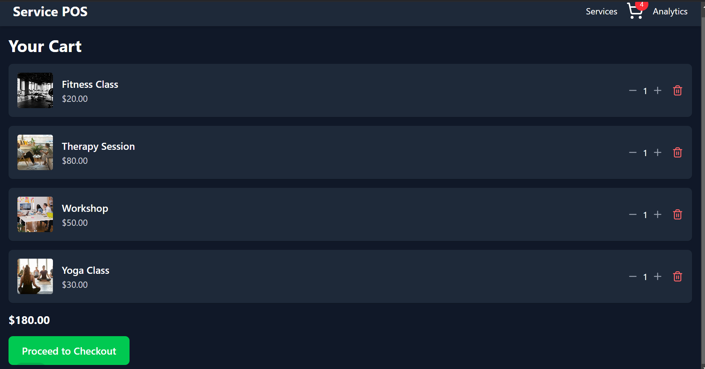
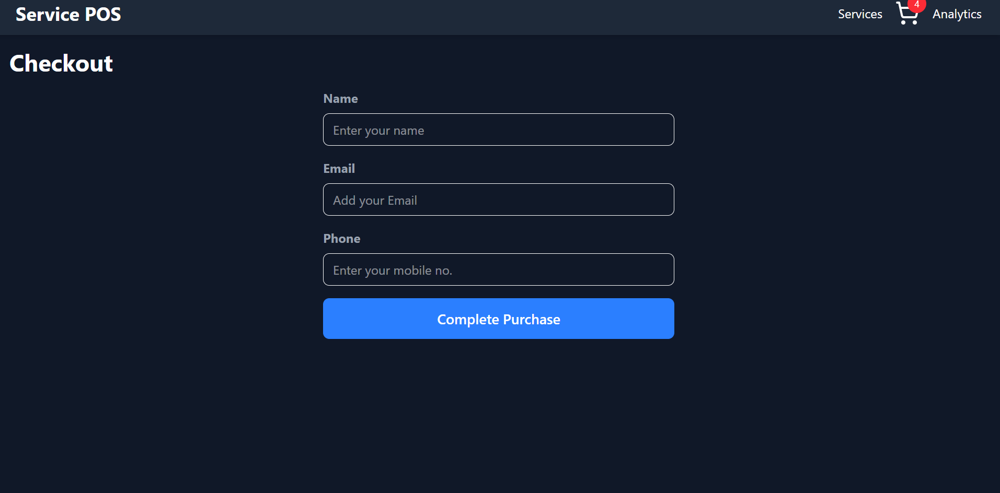
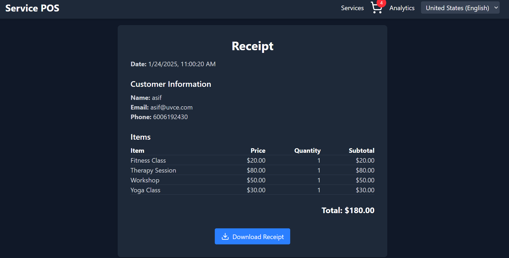
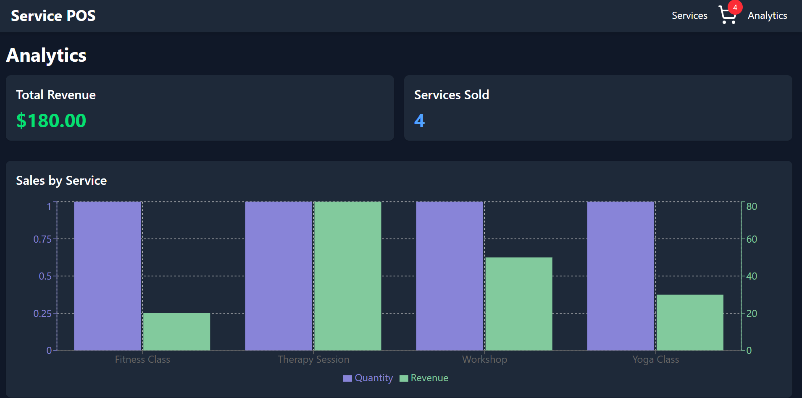
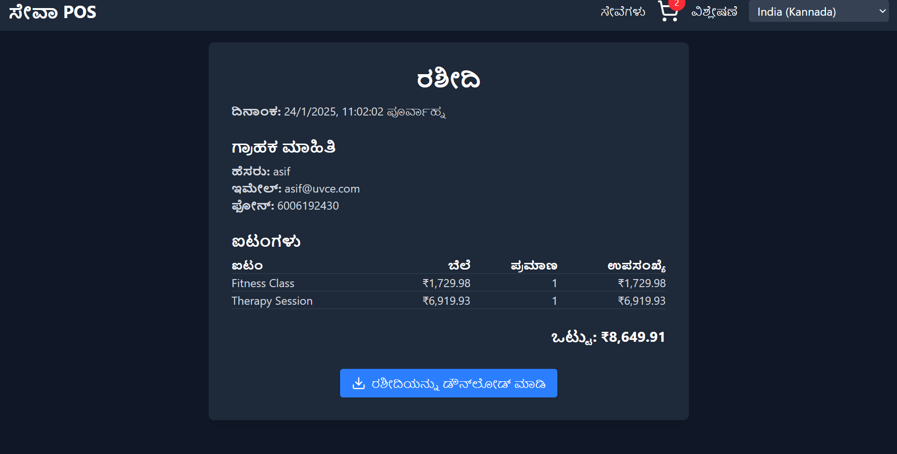

# 🏪 Service Point of Sale (POS) System

A modern, internationalized Point of Sale system designed specifically for service-based businesses. This system simplifies transactions, enhances customer experience, and provides essential tools for managing your business effectively.

---

## 🌟 Features

### 🌐 Multi-language Support
- Supports multiple languages including **English**, **Spanish**, **Hindi**, **German**, **Russian**, **Kannada**, and **French**.
- Ensures that businesses can cater to a global audience with ease.
- Powered by [react-intl](https://formatjs.io/docs/react-intl/) for robust internationalization.

### 💱 Real-time Currency Conversion
- Automatically converts prices to the customer’s preferred currency.
- Fetches real-time exchange rates using a reliable API.
- Enhances the shopping experience for international customers.

### 🛒 Shopping Cart Functionality
- Users can add, update, or remove services from the cart.
- Displays itemized lists of selected services with a real-time total calculation.
- Provides a seamless checkout experience.

### 🧾 Downloadable Receipts
- Generates professional, printable receipts for completed transactions.
- Option to download receipts.


### 📊 Basic Analytics Dashboard
- Offers insights into business performance with key metrics such as:
  - Total sales
  - Number of transactions
  - Popular services
- Designed for simplicity, making it easy for business owners to track performance.

### 🔍 Service Search and Filtering
- Enables users to search for specific services by name.
- Filters services by categories.
- Helps customers quickly find what they need.

### 📱 Responsive Design
- Fully optimized for desktops, tablets, and mobile devices.
- Ensures a smooth and consistent user experience across all screen sizes.

---

## 🚀 Getting Started

### Prerequisites
- **Node.js** (v14 or higher)
- **npm** (v6 or higher)

### Installation
1. Clone the repository:
   ```bash
   git clone https://github.com/AsifMohd01/pos-system.git
   ```
2. Navigate to the project directory:
   ```bash
   cd pos-system
   ```
3. Install dependencies:
   ```bash
   npm install
   ```
4. Run the development server:
   ```bash
   npm run dev
   ```

---

## 🛠️ Technologies Used

- **React**: Frontend library for building user interfaces.
- **Tailwind CSS**: Utility-first CSS framework for styling.
- **react-intl**: For managing internationalization and translations.
- **Framer Motion**: For smooth and engaging animations.
- **Lucide React**: Icon library for modern and scalable vector icons.

---

## ⚠️ Limitations and Assumptions

- The system requires a stable internet connection for:
  - Fetching real-time currency exchange rates.
  - Loading images and external assets.
- **Analytics**:
  - Basic insights only; advanced reporting and data visualization are not included.
- **Authentication**:
  - Does not include user login or role-based access control.
- **Payment Processing**:
  - Checkout is simulated and does not integrate with a payment gateway.
- **Internationalization**:
  - Basic support for translations; advanced context-specific translations are not implemented.

---

## 📸 Screenshots

- **Home Page**
  

 - **Services Filtering**
  

- **Cart Page**
  

- **Checkout Page**
  

- **Receipt Page**
  

  - **Analytics Dashboard**
  

   - **Multiple Language Support**
  

  
---

## 🙏 Acknowledgements

- [React Intl](https://formatjs.io/docs/react-intl/) for internationalization support.
- [Tailwind CSS](https://tailwindcss.com/) for elegant and responsive styling.
- [Framer Motion](https://www.framer.com/motion/) for animations.
- [Lucide Icons](https://lucide.dev/) for modern icons.

---


